# BOOK SITTERS CLUB
BSC is a site that is targeted towards bringing  together a small group of young adults passionate about reading and talking about books in London, Uk. 
BSC will be useful for book lovers to see what book would be read monthly at the regular meet up venue and time. 
Users of this website would find information about BSC; About us, meeting time, venue and a contact form for further enquires. 

* [The live link can be found here.]( https://oyindamolabadara.github.io/book-club/) 

# FINAL DESIGN
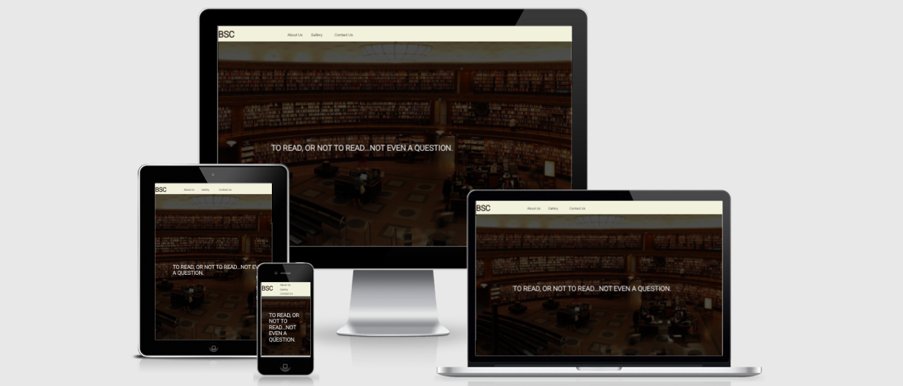

# USER EXPERIENCE(UX)
* ## First Time User Goals
  * As a first time visitor, I want to understand why and how the book club was created. 
  * I want the site to be easily accessible and able to easily navigate to find content.
  *  I want to locate their social media links to see their followings on social media and activities. 
* ## Returning User Goals
  * As a returning user, I want to find the best way to get in contact with the organisers.
  * I want to recommend the book club to friends and family. 
* ## Frequent User Goals
  * As a frequent user, I want to find updates about the book club activities, book of the month and change in venue.

# DESIGN
## COLOR SCHEME
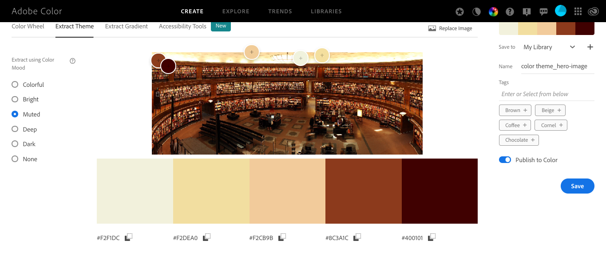
The color schemes were gotten from [Adobe Color](https://color.adobe.com/create/image) using the hero image to extract different color schemes that matched it. 
I used the color #f2f1dc for the  navbar  and footer to make the links visible and stand out. 
I used #f2dea0 for the background of the site.
I used #f2cb9b for the  form section to make it stand out from other contents. 

# WIREFRAME
The initial idea for this site was to be very simple and basic, but as I progressed with the design I decided to expand the design a bit more with other ideas.
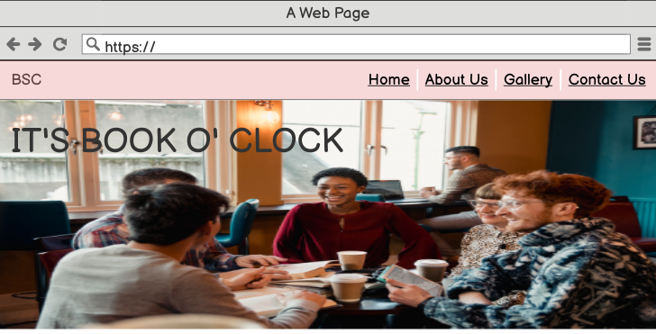
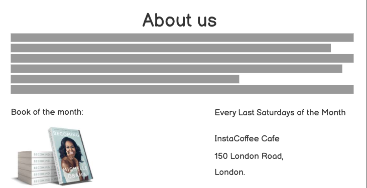
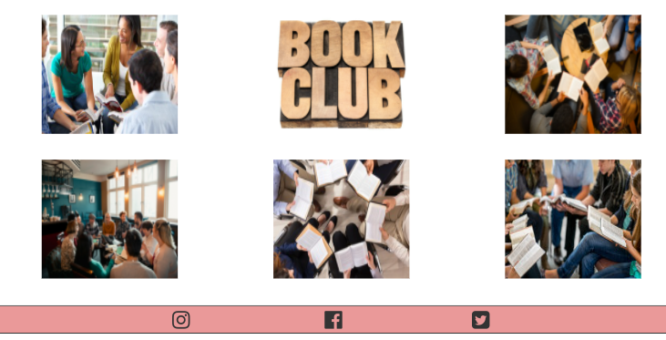

# FEATURES
I have used the following features in this project:
* ## Hover
  * Tells the user the location of the mouse whilst navigating the menu.
* ## Contact Form
  * Form validation requests the user to input the correct information in the input fields.
  * Avoids the user accidentally sending blank or incomplete forms.

# Existing Features
## Navigation Bar
* Featured at the top of the page, the navigation shows the club name, BSC in the left corner. 
* The other navigation links are to the right: About us, Gallery and Contact us which links to different sections of the same page. 
* The navigation has a color that contrasts with the background.
* The navigation clearly tells the user the name of the club and website and makes the different sections of the information easy to find.
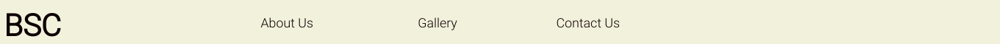

## The landing page image 
* The landing includes a photograph with text overlay of an eye catching book quote to grab their attention.
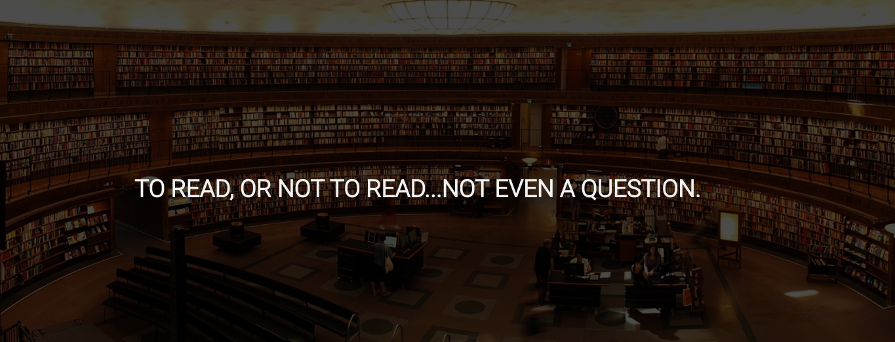

## About Us Section
* The About us section gives details about the background of the book club, how and when it started,  it's mission and when the meet up takes place. 
* The About Us section also contains an image of the book of the month, which would be updated as required. 
* This section also gives details of the venue for the meet up. 
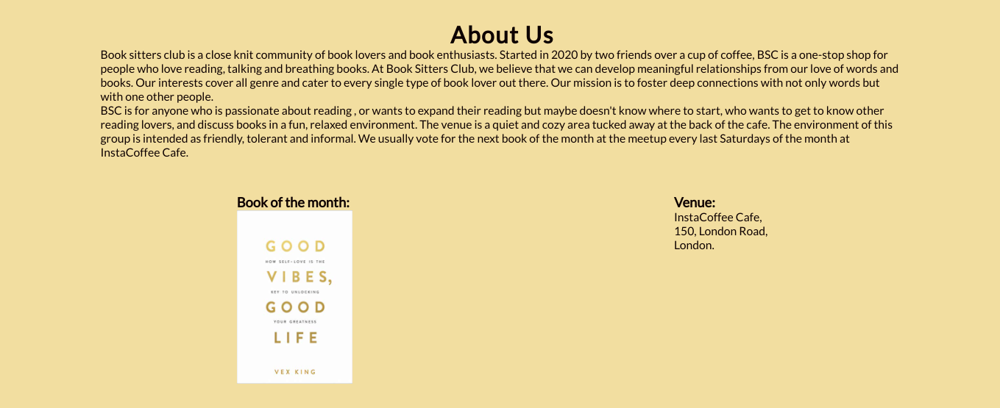

## The Gallery Section
* The gallery provides the user with a video of one of the book reviews held at the Cafe.
* This section also provides supporting images of the book club. 
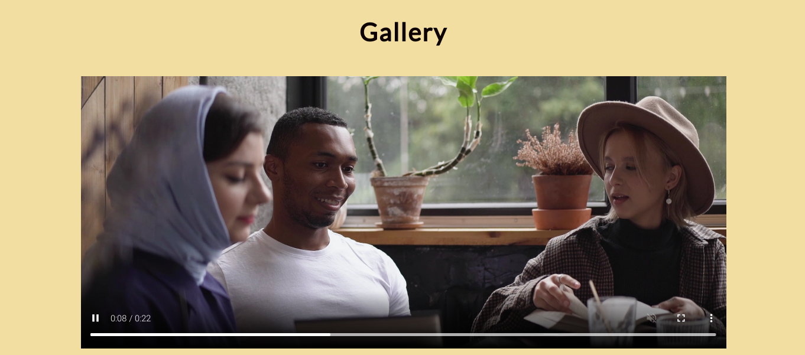
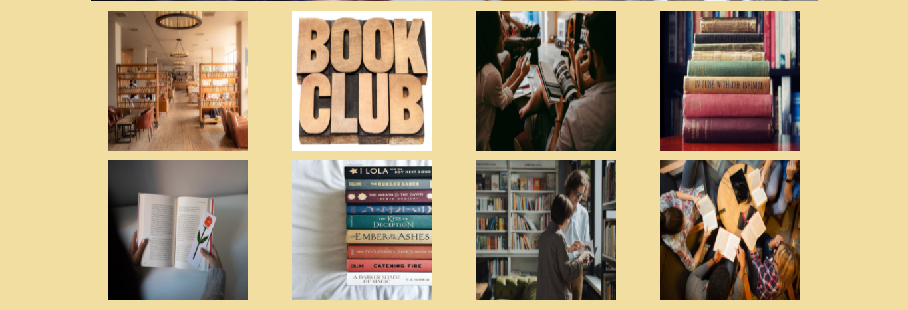

## The Contact Us Section
* The Contact us section allows users to submit a form, containing the first and last name, email address and the message for further enquires.
* A message showing that the form was submitted successfully also open in a new tab. 
* This section is valuable to the user, as it gives them the ability to contact the book club if they need to. 
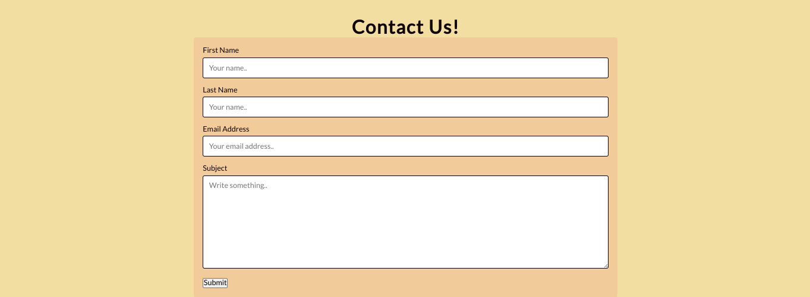

## The Footer Section
* The footer section includes links to the relevant social media sites for BSC. The links will open to a new tab to allow easy navigation to the user. 
* The footer is valuable to the user as it encourages them to keep connected via social media.
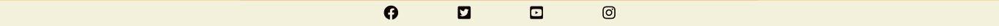

# SOLVED BUGS
* When I ran my code through W3C Validators, I was given an error message saying there was a bad value for the width on the video element. Expected a digit but saw percentage instead. This was fixed by removing the percentage and changing the value, i.e from 80% to 80.  
* I designed for the desktop version first, which gave me some issues whilst trying to make the site responsive, the images in the gallery section and the navbar specifically. I managed to fix this using the grid-template-column. 
* Another error message was given on the W3C Validators about the grid-template-columns. It said 1fr is not a gap value. This was fixed by changing 1fr to 25%. 
* After checking again, there were no further errors. 

# TECHNOLOGY USED

* Font Awesome: 
 [Font Awesome](https://fontawesome.com/) was used to add icons for the footer. 
* Google Fonts:
 [Google Fonts](https://fonts.google.com/) was used  to import the fonts used for all the text content on the site pages.
* Git:
Git was used for version control by using the Gitpod terminal to  commit to Git and push to GitHub.
* GitPod:
GitPod was used as an IDE whilst coding this site.
* GitHub:
GitHub is being used to store all the code for this project after being pushed from GitPod.
* Formspree:
[Formspree](https://formspree.io/) was used to embed the contact us form. 
* Am I Responsive: 
 [Am I Responsive](http://ami.responsivedesign.is/#) was used to create the images in the Final Design section.
* Balsamiq: 
[Balsamiq](https://balsamiq.com/) was used in the initial design process to make wireframes.
* Chrome Developer Tools:
Chrome Developer Tools was used for trouble shooting and trying new visual changes without it affecting the current code.

# TESTING
* I tested that this page works in different browsers.
* I have ensured that this project is responsive, looks good and functions on all  standard screen sizes using the devtools device toolbar.
* I have confirmed that all texts are readable and easy to understand. 
* I have confirmed that the form works, requires entries in every field,  will only accept an email in the email field and the submit button works. 

# VALIDATOR TESTING
The [W3C Markup Validator](https://validator.w3.org/nu/?doc=https%3A%2F%2Foyindamolabadara.github.io%2Fbook-club%2F) and [W3C CSS Validator](https://jigsaw.w3.org/css-validator/validator?uri=https%3A%2F%2Foyindamolabadara.github.io%2Fbook-club%2F&profile=css3svg&usermedium=all&warning=1&vextwarning=&lang=en)  was used to validate my project to make sure no errors were returned.

# ACCESSIBILITY
I confirmed that colors and fonts chosen are easy to read and accessible by running it through lighthouse in devtools.
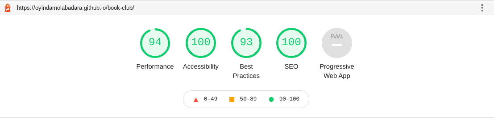

# DEPLOYMENT
The site was deployed to GitHub pages. The steps to deploy are as follows:
1. Login or Sign Up to GitHub.
2. Create a new repository named "book-club".
3. Once created, click on "Settings" on the navigation bar under the repository title.
4. Click on "Pages", on the left hand side below Secrets.
5. Under "Source", choose which branch you wish to deploy, In most cases it will be "main".
6. Choose which folder to deploy from, generally from "/root".
7. Click "Save", then wait for it to be deployed. It may take some time for the page to be fully deployed.
8. The URL will be displayed above the "source" section in GitHub Pages.

# CREDITS
## CONTENTS
* The code to make the social media links was taken from CI [Love Running](https://github.com/Code-Institute-Solutions/love-running-2.0-sourcecode/blob/main/06-site-footer/01-footer-main-structure/index.html) Project. 
* The code to make the form was taken from the [W3 Schools Website](https://www.w3schools.com/howto/howto_css_contact_form.asp) with some adjustments. 

## MEDIA
* The book of the month image was taken from [Google](https://www.google.com/search?q=good+vibes+good+life&rlz=1CAGMMR_enGB947&sxsrf=AOaemvKjtVCv-ElpgW9aab04ekxd2u_ZdA:1634833033628&source=lnms&tbm=isch&sa=X&ved=2ahUKEwjZtPHR89vzAhUjyYUKHTfEDi8Q_AUoAnoECAEQBA&biw=1300&bih=580&dpr=1.05)
* Other images were taken from [Pixels.](https://www.pexels.com/photo/photography-of-library-room-12064/)
* The video in the gallery was also taken from [Pexels.](https://www.pexels.com/video/group-of-people-talking-while-holding-a-book-5359175/)

# ACKNOWLEDGEMENTS:
* I would like to thank [AbdulFattah Badara](https://github.com/fobadara) for all his support and patience during this project. 
* I would also like to thank my Code Institute mentor, [Anthony Ugwu](https://github.com/tonyguesswho)  for all his support, encouragement and corrections. 

