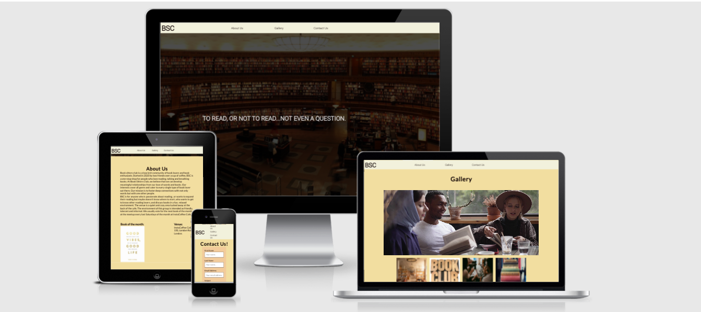

# BOOK SITTERS CLUB
BSC is a site that is targeted towards bringing  together a small group of young adults passionate about reading and talking about books in London, Uk. 
BSC will be useful for book lovers to see what book would be read monthly at the regular meet up venue and time. 
Users of this website would find information about BSC; About us, meeting time, venue and a contact form for further enquires. 

# FINAL DESIGN

# USER EXPERIENCE(UX)
* ## First Time User Goals
  * As a first time visitor, I want to understand why and how the book club was created. 
  * I want the site to be easily accessible and able to easily navigate to find content.
  *  I want to locate their social media links to see their followings on social media and activities. 
* ## Returning User Goals
  * As a returning user, I want to find the best way to get in contact with the organisers.
  * I want to recommend the book club to friends and family. 
* ## Frequent User Goals
  * As a frequent user, I want to find updates about the book club activities, book of the month and change in venue.

# DESIGN
## COLOR SCHEME

The color schemes were gotten from [Adobe Color](https://color.adobe.com/create/image) using the hero image to extract different color schemes that matched it. 
I used the color #f2f1dc for the  navbar  and footer to make the links visible and stand out. 
I used #f2dea0 for the background of the site.
I used #f2cb9b for the  form section to make it stand out from other contents. 

# WIREFRAME
The initial idea for this site was to be very simple and basic, but as I progressed with the design I decided to expand the design a bit more with other ideas.

# FEATURES
I have used the following features in this project:
* ## Hover
  * Tells the user the location of the mouse whilst navigating the menu.
* ## Contact Form
  * Form validation requests the user to input the correct information in the input fields.
  * Avoids the user accidentally sending blank or incomplete forms.

# Existing Features

